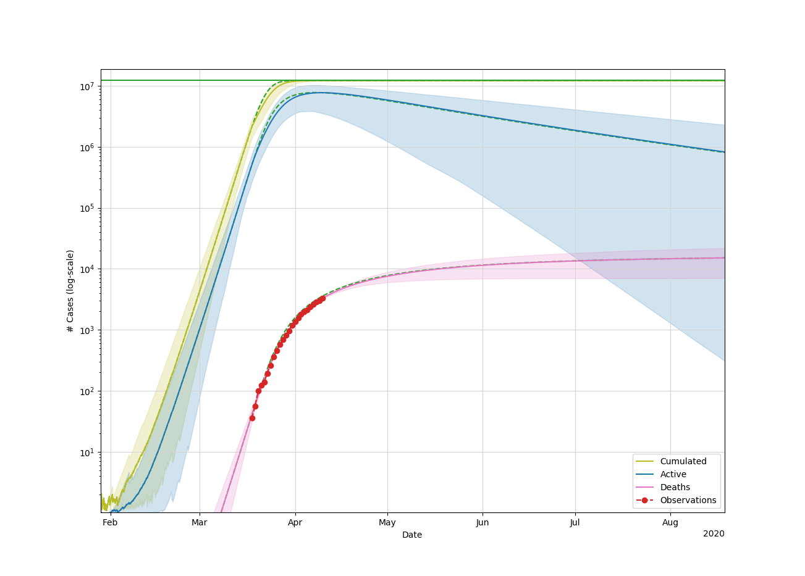

Project imported from https://gitlab-research.centralesupelec.fr/datasc_projects_public/bayescovid19.
Realized by CentraleSupelec students Raphael Adda, Maxime Charpentier, Nathan Fouqueray and Prof. Emmanuel Vazquez during the Spring 2020.  

# bayescovid19

Modeling the propagation of the SARS-Cov-2 using a SEIRD model and a Bayesian approach

## Objective

We use a [SEIR(D) model](https://en.wikipedia.org/wiki/Compartmental_models_in_epidemiology#The_SEIR_model) to predict the propagation of the SARS-CoV-2 virus. See also this [epidemic calculator](http://gabgoh.github.io/COVID/index.html) provided by Gabriel Goh. The effect of the lockdown is taken into account.

Our idea was to estimate the parameters of the model from data from [ECDC](https://www.ecdc.europa.eu/en/covid-19-pandemic) using a Bayesian approach. For France, we also use data from [Santé publique France](https://www.santepubliquefrance.fr/maladies-et-traumatismes/maladies-et-infections-respiratoires/infection-a-coronavirus/articles/infection-au-nouveau-coronavirus-sars-cov-2-covid-19-france-et-monde).

### Example of predictions for Italy (03/04/2020)

In the plot below, blue lines correspond to posterior trajectories of the death toll under the hypothesis that the lockdown is never removed. Green lines are posterior trajectories of the number of infected persons. We also represent the posterior means with orange lines, the posterior mean if lockdown was removed now with red lines (almost indistinguishable from the orange lines), and the posterior mean if there had never been a lockdown (pink lines).

### Corresponding posterior distribution of the parameters of the model

## Dependencies
*  numpy
*  scipy
*  pandas
*  matplotlib
*  seaborn
*  pickle
*  emcee
*  tqdm
*  corner

## Usage
* To download and view data:
`python3 view_data.py -i Italy `
* To run an analysis for Italy:
`python3 runme_Italy.py`
* Or France:
`python3 runme_France.py`
* Other countries: review and change the parameters in runme_Italy.py (population size, lockdown date...)

